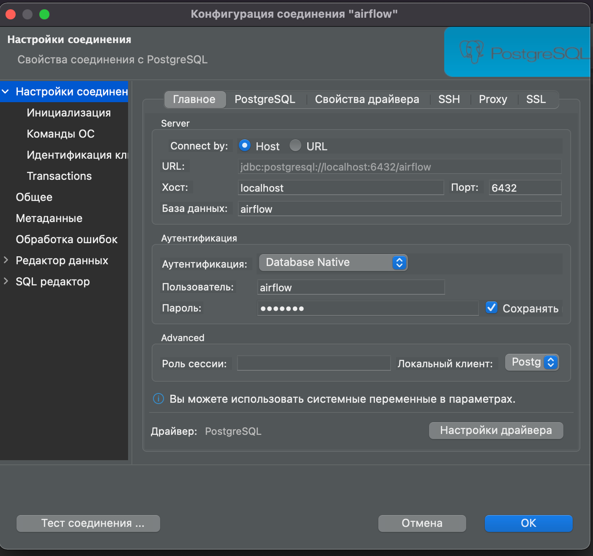
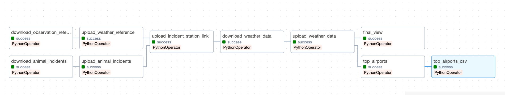

# BirdStrike
## PET project. Pipeline for getting data about aircraft birdstrike incidents

## ОГЛАВЛЕНИЕ:
1. [Как пользоваться всем этим, если ты просто аналитик и у тебя не времени вникать в вот это вот все](#User_guide)
2. [Структура репозитория](#Structure)
3. [Структура Базы данных](#Database)
4. [Запуск проекта](#Start)
5. [Работа DAG](#DAG)
6. [Что можно доделать прям сейчас](#Techdebt)

### Как пользоваться всем этим, если ты просто аналитик и у тебя не времени вникать в вот это вот все

Скачиваешь репозиторий себе, лучше с помощью IDE или VS Code.  
Убеждаешься, что у тебя есть возможность запускать docker на своей машине.  
Заходишь в папку с файлом docker-compose.yaml через терминал или любой другой CLI.  
Вводишь команду docker-compose up ~~молишься чтобы заработало~~  
Через любимый dbeaver (или что душе угодно) подключаешься к контейнеру с PostgreSQL под профилем airflow, пароль airflow, база данных airflow
host localhost, port 6432 как на картинке 

  
Работаешь работу.

Данные по инцидентам и данные о погоде во время инцидента на ближайщей станции наблюдения находятся в таблицах DDS.aircraft_incidents и DDS.weather_observation  
Данные с 1 января 2018 по 31 декабря 2022 года будут автоматически загружены в момент создания контейнера.  

Для запуска обновления через airflow в файле main нужно внести изменния в конфигурацию конкретной таски. 
А именно, нужно изменить даты загрузок
Для загрузки данных о погоде

    task_weather_data = PythonOperator(
        task_id='download_weather_data',
        python_callable=stg_loadings.weather_data,
        op_kwargs={'controller': stg_loadings,
    HERE --->        'start_date': datetime.datetime(year=2020, month=1, day=1),
    HERE --->        'end_date': datetime.datetime(year=2021, month=12, day=31)}) -- ТУТА!!

Для загрузки данных об инцидентах можно ничего не менять. 
Каждый запуск данные будут подгружаться за каждые 8 недели пока не достигнут текущего дня

    task_animal_incidents = PythonOperator(
        task_id='download_animal_incidents',
        python_callable=stg_loadings.animal_incidents_data)

И конечно нужно запустить сам даг (установить кнопку запуска в синее положение)  

Не понятно или не работает, пиши в телеге @YarRuss12

### **Структура репозитория**
- docker-compose.yaml - файл с инструкцией по созданию докер-контейнеров для приложения  
- .env - файл с переменными окружения для контейнеров airflow (пока просто на перспективу)  
- Dockerfile - файл с детализацией инструкции по созданию контейнеров airflow  
- requirements.txt - сторонние библиотеки (осторожно, возможно в нем много лишних!!!)  
- Database
  - Dockerfile - файл с детализацией инструкции по созданию контейнера для базы данных
  - 0_init_db.sql - инструкция сборки базы данных для инцидентов и погоды
  - 1_aircraft_incidents.sql - dump с таблицей об инцидентах детализированного слоя
  - 2_weather_observation.sql - dump с таблицей о погоде приминительно к каждому инциденту детализированный слой
- dags - папка с ДАГами и модулями
  - main.py - основной ДАГ с загрузкой полного цикла
  - only_incidents.py - ДАГ, загружающий сведения только об инцидентах
  - only_weather.py - ДАГ, загружающий сведения только о погоде принимительно к конкретному инциденту
  - config.py - модуль с параметрами подключения к базам данных (сейчас только 1)
- modules
  - str_loader.py -- модуль с классом StgControler для работы с сырыми данными
  - dds_loader.py -- модуль с классом DdsControler для загрузки данных в детализированный слой
  - cdm_loader.py -- модуль с классом CdmControler для формирования datamart и выгрузки csv файлов
  - instruments.py -- модуль с прикладными функциями(некоторые не пригодились)
  - connections.py -- модуль с классом для подключения к базам данных

### **Структура Базы данных**
- Схема Stage
  - aircraft_incidents -- сырые данные об инцидентах
  - observation_reference -- справочник о станциях наблюдения за погодой
  - weather_observation -- сырые данные о погоде
- Схема DDS 
  - aircraft_incidents -- обработанные данные об инцидентах 
  - observation_reference -- актуальный справочник станций наблюдений за погодой 
  - incident_station_link -- таблица соединяющая инцидент с ближайшей станцией 
  - weather_observation -- таблица с данными о погоде для конкретного инцидента
- Схема CDM 
  - top_ten_airports -- таблица с топ 10 аэропортах по числу инцидентов 
  - airport_bts_name -- таблица-справочник соединяющая id аэропорта с наименованиями, принятыми BTS

### **Запуск проекта**
Файл docker-compose.yaml с помощью команды docker-compose up -d создает докер-контейнеры с СУБД PostgreSQL, airflow и remote webserver  
В контейнере birdstrike-database-1 создается базf данных, из дампов наполняются таблицы dds.aircraft_incidents и dds.weather_observation
Создаются папки Archives, Unresolved, Downloads  
Airflow и remote webdriver работают через передачу скаченных файлов из volume папки Downloads

### **Работа DAG**
Все в репозитории 3 Дага:
- общий даг FULL DAG  
- only_incidents  
- only_weather  

Опишим работу общего ДАГа main.py (два других это просто усеченные версии)  

1. Загрузка справочника о станциях

    Важно! В NCEI формат id станции это 11 символов. USAF и WBAN могут быть менее заданного числа
    Поэтому перед соединением следуем добавить к USAF неоходимое число нулей, чтобы длинна USAF была 6 символов
    Для WBAN требуется такая же процедура, но число символов должно быть 5

2. Обновление справочника в DDS слое
  
3. Загрузка данных о авиационных инцидентах с участием животных.  
   На заданные пользователем даты (или по умолчанию за 8 недель c максимальной даты в базе) создается выборка из базы данных Federal Aviation Administration через selenium remote webdriver.  
   Чем больше выборка, тем больше времени нужно чтобы сайт собрал excel файл и тем больше времени нужно selenium webdriver чтобы скачать файл. 
        Поэтому до перехода к следующему этапу выполняется time.sleep(n), и несколько попыток скачать собранный файл.  
   Файл сохраняется remote webdriver в папку volumes Downloads, откуда его берет для обработки airflow.  
   Полученный файл разархивируется и сохраняется в dataframe, после чего заливается в базу данных
4. Сырые данные об инцидентах обрабатываются и переливаются в DDS слой.  
5. На данных об инцидентах и справочных данных о станциях наблюдений создается таблица связей между инцидентом и станцией.  
   С помощью функций postgreSQL расчитывается растояние между координатами и черезе оконную функцию row_number выбирается запись с наименьшим расстоянием.
6. Выполняется загрузка данных о погоде.  
   Из таблицы инцидентов и таблицы связей создается упорядоченная выборка за указанный пользователем период из indx_nr, incident_date, time, weather_station. 
   Сайт не может отдавать данные более чем за 50 станций, поэтому для простоты обработки выборка об инцидентах обрабатываются маленькими батчами по 50 записей.
   Наибольшая и наименьшая даты инцидентов в батче это диапазон выборки для запроса на сайт. 

    
    &startDate={start_datetime}T00:00:00&endDate={end_datetime}T23:59:59

   Список всех станций передается в параметр stations_id

    &stations={stations_id}

   Полученный файл сохраняется selenium remote webdriver в папку volumes Downloads, откуда его берет для обработки airflow  
   Файл преобразуется в датафрейм и заливается в слой сырых данных.
7. Сведения о погоде, через таблицу связей объединяются с инцидентом. На этом этапе отбирается наиболее ближайшая запись по дате и времени между инцидентом и собранной выборкой по ближайшей станции
   В рамках каждого инцидента расчитывается модуль разницы между датой и временем записи о погоде и датой и временем инцидента определяется число минут между ними, и выбирается запись с наименьшим значением
   Получается таблица с данными о погоде для каждого инцидента
8. Загрузка данных о 10 аэропортах с наибольшим числом инцидетов с животными
   Из таблицы DDS.aircraft_incidents выбираются 11 аэропортоа с наибольшим числом инцидетов (в том числе UNKNOWN).  
   Через inner join выполняется соединение выборки с табилцей DDS.airport_bts_name.  

   
    INNER JOIN зарезает выборку аэропортов с именем UNKNOWN, однако принимательно к этой задаче это не проблема. 
    Так как на сайте BTS невозможно собрать данные по неизместному аэропорту

   DDS.airport_bts_name пока создается вручную. Это справочник с названиями аэропортов на сайте Bureau of Transport Statistics.
   Созданный список tuples_airports из id, названия аэропорта по система Federal Aviation Administration и названия аэроторта по системе Bureau of Transport Statistics передается методу "top_airports_traffic"
   С помощью Selenium webdriver открывается страница Bureau of Transport Statistics, выбирается вкладка 'Link_Flights'. Каждый аэропорт в tuples_airports обрабатывается, вызывается таблица со вседениями об отбывающих рейсах и о прибывающих рейсах.
   Полученные записи записываются в cdm.top_ten_airports с указанием id, названия, статистики и даты построения выборки. Результат сохраняем в csv.

9. Финальная выборка данных об инцидентах и погоде выполняется последним шагом. Ничего особенного, просто делаем временную вьюху и из нее качаем данные в csv

### **Что можно додеать еще**
Открытым остается вопрос правильной обработки записей с пустым временем инцидента, но тут не мне нужно рпидумывать что делать, 
а аналитику сказать, что будет по его мнению репрезентативным.

Успехов!

#Раздел_для_пользователя